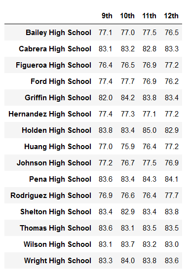
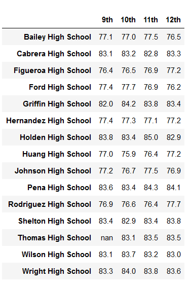
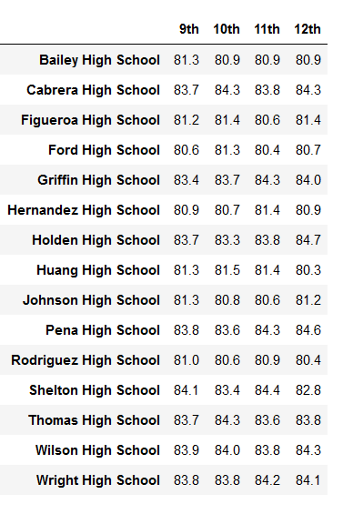
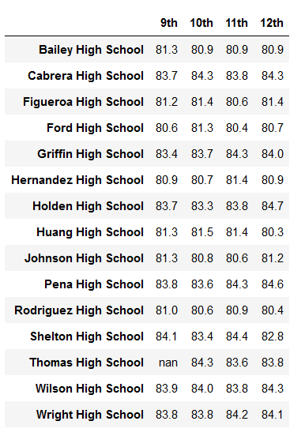

# School_District_Analysis
# Overview of the school district analysis
The school board has noticed that the students_complete.csv file shows evidence of academic dishonesty; specifically, reading and math grades for Thomas High School ninth graders appear to have been altered. They asked to replace the math and reading scores for Thomas High School with NaNs while keeping the rest of the data intact. The School board wants to repeat the school district analysis such as funding, student grades and providing each school's performance, that we did in this module and write up a report to describe how these changes affected the overall analysis.

# Results
### How is the district summary affected?

Due to potential academic dishonesty by the ninth grade students of Thomas High School, this analysis was conducted another time. In the first time, analysis included the full set of student data. In the second time of this analysis, we have omitted the scores of ninth grade students of Thomas High School from the calculations. The entire ninth grade class of Thomas High School have had their scores replaced with NaN. The DataFrame below is a summary representing the District before and after replacing the ninth graders' scores with NaN. 

* District Summary(Challenge)

* District Summary(Module4)

### How is the school summary affected?

Replacing the math and reading scores of 9th grade students at Thomas High School with NaN, result has been changed only for Thomas High School and all other school has the same results.
When counting the number of students passing the math/reading, the 9th grade students with "NaN" scores are ignored. Thus, the number of  students passing math/reading is decreased compared with initial analysis. The passing percentage is calculated using the number of students passing the math/reading devided by the total number of students,including 9th graders. As a result, the value for math, reading and overall % Passing for Thomas High School are decreased significantly.
"loc" Method is used to count the total number of students at Thomas High School in 10th grade, 11th grade and 12th grade. The total number of students, except the 9th grade students and resulted in 1174 students. Calculation ignores 9th grade students' scores with "NaN" . Then the total number of students and the number of passing students are both decreased by 9th grade students, so that didn't affect the passing percentage.

The school summary tables for the Thomas High School from the Module analysis and the challenge analysis are as below,

* School Summary(Challenge)

* School Summary(Module4)

### How does replacing the ninth graders’ math and reading scores affect Thomas High School’s performance relative to the other schools?

* Top 5 schools(challenge)
When the ninth graders' of Thomas High School had their scores omitted from the calculations, the following changes occured,

* Top 5 schools(module4)

### How does replacing the ninth-grade scores affect the following:

#### Math and reading scores by grade: 
 That affected only to the Thomas High School, the scores for other schools remain unchanged.

Math scores(module4)                    |  Math scores(Challenge)
:--------------------------------------:|:-------------------------:
  |  

Reading scores(module4)                   |  Reading scores(Challenge)  
:----------------------------------------:|:-------------------------:
 |  

#### Scores by school spending

There is no big difference for the math and reading scores by school spending before and after replacing the 9th grade scores. 

* School Spending Summary(challenge)

* School Spending Summary(module4)

    
#### Scores by school size

Scores by school size are the same after replacing the scores of 9th grade students at Thomas High School.

* Scores by school size(Challenge)

* Scores by school size(module4)

#### Scores by school type

There is no difference between the scores by school type.

* Scores by school type(challenge)

* Scores by school type(module4)

# Summary
Four changes in the updated school district analysis after reading and math scores for the ninth grade at Thomas High School have been replaced with NaNs.

* Relacing the ninth graders' scores with NaN caused Thomas High School's overall passing percentages to dropdown.
* Passing percentages of maths and reading are decreased.   
* The district as a whole has also had its average math and reading scores decrease, as well as the overall passing percentage for students.
* Thomas High School lost its placement as a top five school within this District. However, after updating the total student counts to exclude the Thomas High School ninth graders and omitting their scores from the dataset, Thomas High School regained its high average scores.

